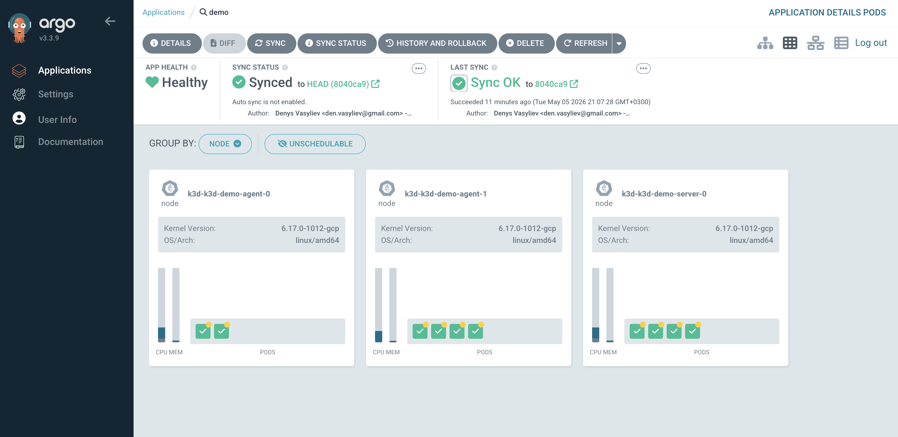

# Запуск проекту Argo cd та синхронізація




```
kubectl get all -n argocd 
kubectl get all -n demo

curl localhost:8081
wget -O /tmp/g.png https://img2.gratispng.com/20180406/xhq/kisspng-computer-icons-house-window-blinds-shades-brookl-adress-5ac7dd63724750.6622363615230477794681.jpg
curl -F 'image=@/tmp/g.png' localhost:8081/img/

argocd app list
argocd app sync argocd/demo
```

**Падіння argo cd ambasador (фікс)**

**/etc/docker/daemon.json**
```
{
  "default-ulimits": {
    "nofile": {
      "Name": "nofile",
      "Hard": 1048576,
      "Soft": 1048576
    }
  }
}
```

```
sudo systemctl restart docker
k3d cluster delete k3d-demo
k3d cluster create k3d-demo
```

перевірка змін
```
docker exec k3d-k3d-demo-server-0 sh -c "ulimit -n"
```

якщо не допомогло

```
docker exec k3d-k3d-demo-server-0 sh -c "cat /proc/sys/fs/inotify/max_user_instances"
docker exec k3d-k3d-demo-server-0 sh -c "cat /proc/sys/fs/inotify/max_user_watches"
```
```
docker exec k3d-k3d-demo-server-0 sh -c "echo 1024 > /proc/sys/fs/inotify/max_user_instances"
docker exec k3d-k3d-demo-server-0 sh -c "echo 524288 > /proc/sys/fs/inotify/max_user_watches"
kubectl rollout restart deployment ambassador -n demo
```