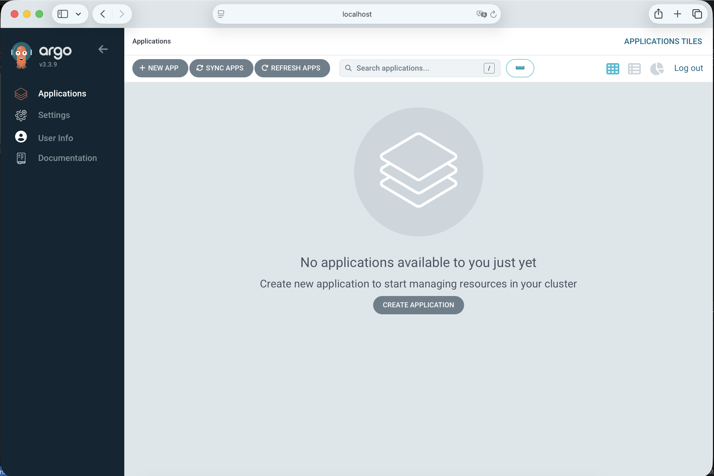

# Argo cd доступ

**Налаштування доступу (Port-Forwarding)**

```
kubectl port-forward svc/argocd-server -n argocd 8080:443 --address 0.0.0.0
```

**Отримання початкового пароля**

```
kubectl -n argocd get secret argocd-initial-admin-secret -o jsonpath="{.data.password}" | base64 -d
```


